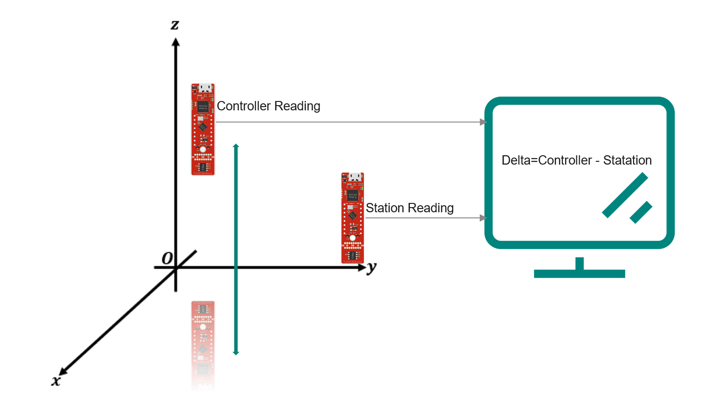

# IFX-Man
The goal of the project is to write a game where the user can play by vertically moving a controller Up and Down. This vertical motion has to be captured and its respective data sent wirelessly to the game station, where a python game is to be played
<div style="text-align:center">
    
</div>


## Current Setup
2 XMC2Go each connected to a DPS310 sensor. Both uControllers are connected to a computer and both are simultaneously serially transmiting their air pressure readings.

<div style="text-align:center">
    
</div>

These two microcotrollers are setup as follows:
   * station (placed on a reference surface)
   * Dynamic Controller (Held in the hand of the user)

The computer then calculates the difference delta between the pressure measured at the station and the dynamic controller. This delta value is used as an offset, where an upper and lower threshold is calculated for detecting the vertical motion of the dynamic controller


This setup allows maximum noise negation as only the difference delta between both readings of the sensors is taken into account


**ISSUE:**: Overtime the **delta** value drifts


### Serial Comunication between microcontrollers and Computer
For serial communication we utilize the '**serial**' python module. 
```python
import serial
```
**Initialization of Serial Ports:**
```python
base_station = serial.Serial('COM30', 9600, timeout=1)
dynamic_controller = serial.Serial('COM36', 9600, timeout=1)
```
We already established in advance that the COM ports for the base station and dynamic controller are respectively **COM30** and **COM36**. So all we had to do was to write these two lines in order to inform our code. 
```python
def get_float_from_port(port):
	"""Try reading a line from a port and convert to float."""
	try:
		line = port.readline().decode().strip()
		return float(line)
	except ValueError:
		print(f"Couldn't convert '{line}' to float.")
		return None
```
* **port.readline()**: This reads a line from the serial port until a newline character is found. It returns the line as bytes.

* **decode()**: This decodes the bytes into a string using a default UTF-8 encoding.
* **strip()**: This removes any leading or trailing white spaces or newline characters from the string.

**Note**: Do not directly add the get_float_from_port() function into your game loop because then your code flow will be limited by the times at which you receive serial messages from the microcontrollers. Instead execute the function in an if condition that checks if there is data available on the serial bus as follows:

```python
	if (base_station.in_waiting > 0) and (dynamic_controller.in_waiting > 0) :
		base_value = get_float_from_port(base_station)
		controller_value = get_float_from_port(dynamic_controller)
```

### calibration
for the game to run and the characters to appear the **firstCalibrationFlag** has to be set to **True**. This ensures that calibration is performed at least once before gameplay starts.
``` python
		if (counterFirstCalibration<10):
		  counterFirstCalibration+=1
			bufFirstCalibration.add(int(controller_value - base_value))
			if(counterFirstCalibration==10):
				calibratedOffset=bufFirstCalibration.average()
				upperThreshold = calibratedOffset + 2
				lowerThreshold = calibratedOffset -2
				firstCalibrationFlag=True
```
This code snippet runs right after the booting up the game it essentially captures 20 measurements (10 from each microcontroller) performs the delta calculation and takes the average of them. The user also has the option to recalibrate by pressing the keyboard buton '**a**' ; this resets the counterFirstCalibration variable to 0. 


