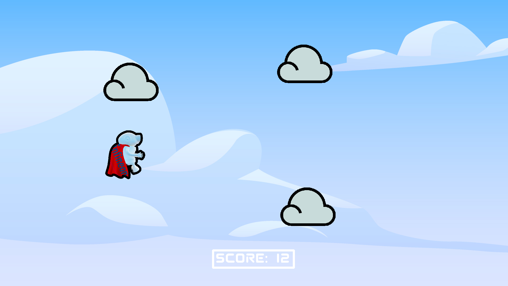
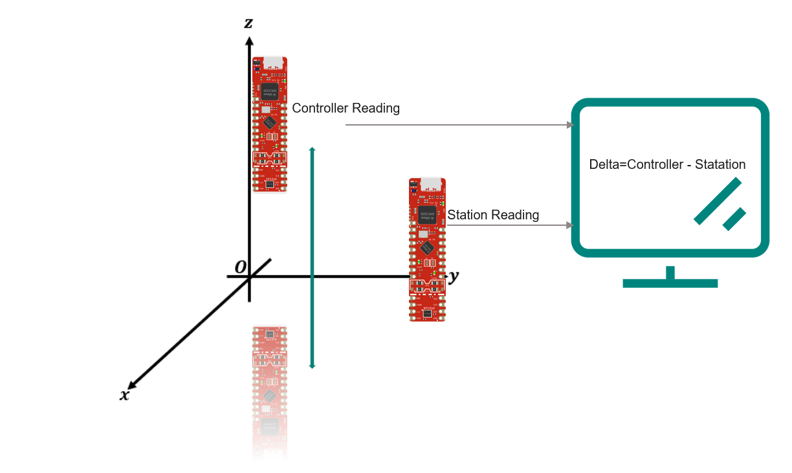
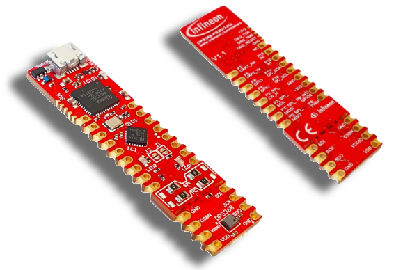
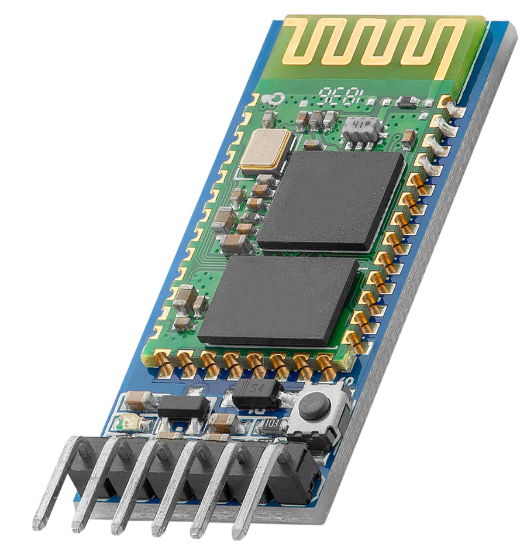
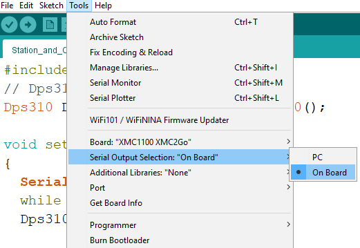
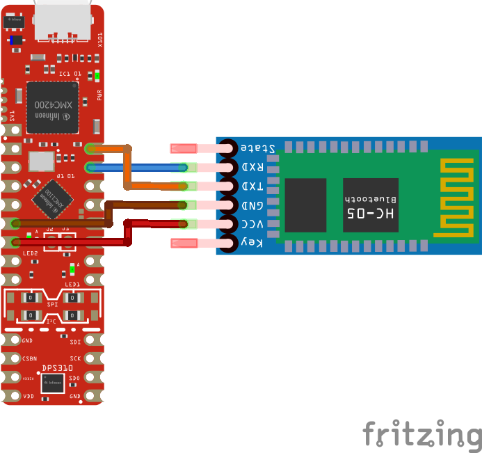

# IFX-Man
The goal of the project is to write a game where the user can play by vertically moving a controller Up and Down. This vertical motion has to be captured and its respective data sent wirelessly to the game station, where a python game is to be played


<div style="text-align:center">
    
</div>

## Gameplay
<div style="text-align:center">
    
</div>

+	Initially, the game will calibrate. A warning may be issued to keep the controller stationary.
+	Once calibrated, the game can be started with the 's' key.
+	The character moves up or down based on the motion detected from the controller.
+	Clouds spawn from the right and move towards the character.
+	If the character collides with a cloud, the game ends.
+	The objective is to avoid the clouds and get a high score.
+	The higher the score the faster the clouds move and spawn


## Current Setup
2 DPS310Kits2Go are connected to a computer and both are simultaneously serially transmitting their air pressure readings.

<div style="text-align:center">
    
</div>

These two kits are setup as follows:
   * station (placed on a reference surface)
   * Dynamic Controller (Held in the hand of the user)

The computer then calculates the difference delta between the pressure measured at the station and the dynamic controller. This delta value is used as an offset, where an upper and lower threshold is calculated for detecting the vertical motion of the dynamic controller


This setup allows maximum noise negation as only the difference delta between both readings of the sensors is taken into account


**ISSUE:**: Overtime the **delta** value drifts, so you have to recalibrate whenever the it is possible (for example whenever you lose)

### **Required Libraries**
In this project, a selection of libraries play a crucial role in orchestrating its functionality. Foremost among these is **pygame**, a widely celebrated library in the Python ecosystem, dedicated to game development. Pygame facilitates everything from rendering graphics and detecting collisions, to managing in-game events and displaying on-screen text. Complementing Pygame's capabilities, the **serial** library is leveraged to establish communication with hardware devices. It allows the game to fetch real-time data from serially connected devices, integrating physical motion into the gameplay. Additionally, Python's built-in libraries, such as **sys** and **random**, aid in system-specific functionalities and introduce randomness into the game respectively.
### **Serial Communication between microcontrollers and Computer**
For serial communication we utilize the '**serial**' python module. 
```python
import serial
```
**Initialization of Serial Ports:**
```python
base_station = serial.Serial('COM29', 9600, timeout=1)
dynamic_controller = serial.Serial('COM31', 9600, timeout=1)
```
We already established in advance that the COM ports for the base station and dynamic controller are respectively **COM29** and **COM31**. So all we had to do was to write these two lines in order to inform our code. 
```python
def get_float_from_port(port):
	"""Try reading a line from a port and convert to float."""
	try:
		line = port.readline().decode().strip()
		return float(line)
	except ValueError:
		print(f"Couldn't convert '{line}' to float.")
		return None
```
* **port.readline()**: This reads a line from the serial port until a newline character is found. It returns the line as bytes.

* **decode()**: This decodes the bytes into a string using a default UTF-8 encoding.
* **strip()**: This removes any leading or trailing white spaces or newline characters from the string.

**Note**: Do not directly add the get_float_from_port() function into your game loop because then your code flow will be limited by the times at which you receive serial messages from the microcontrollers. Instead execute the function in an if condition that checks if there is data available on the serial bus as follows:

```python
	if (base_station.in_waiting > 0) and (dynamic_controller.in_waiting > 0) :
		base_value = get_float_from_port(base_station)
		controller_value = get_float_from_port(dynamic_controller)
```

### **calibration**
for the game to run and the characters to appear the **firstCalibrationFlag** has to be set to **True**. This ensures that calibration is performed at least once before gameplay starts.
``` python
		if (counterFirstCalibration<10):
		    counterFirstCalibration+=1
            bufFirstCalibration.add(int(controller_value - base_value))
			if(counterFirstCalibration==10):
				calibratedOffset=bufFirstCalibration.average()
				upperThreshold = calibratedOffset + 2
				lowerThreshold = calibratedOffset -2
				firstCalibrationFlag=True
```
This code snippet runs right after the booting up the game it essentially captures 20 measurements (10 from each microcontroller) performs the delta calculation and takes the average of them. The user also has the option to recalibrate by pressing the keyboard button '**a**' ; this resets the counterFirstCalibration variable to 0. 

## **Characters**
Sprites are like the actors in a video game, representing characters or objects. Using them makes coding games more organized. They help in easily checking for overlaps or collisions, grouping similar objects together, creating animations, and ensuring the game runs smoothly. Think of them as the building blocks that make both designing and playing games seamless.

### **The ifxMan Class**
This class represents the primary character (or sprite) that the player controls.
<div style="text-align:center">
    
</div>

+	**Initialization Method (__init__)**

+	**super().__init__()**: This calls the initialization method of the parent class (pygame.sprite.Sprite), ensuring that all the built-in properties and methods of the Sprite class are inherited.

+	**self.image**: Loads the image of the character using **pygame.image.load()**. The convert_alpha() method ensures that the alpha channel (transparency) of the image is preserved.

+	**self.image=pygame.transform.scale_by(self.image, 0.3)**: This scales the image by 30%, making the sprite smaller.

+	**self.rect**: Retrieves a rectangular area from the image which will be used for positioning, collision detection, etc. It's set to appear in the middle top portion of the window.

+	**self.mask**: Creates a mask for the image. Masks are used in Pygame for pixel-perfect collision detection.

+	**collisionsWithClouds Method**: This method checks if the ifxMan sprite (or character) collides with any sprite in the cloudGroup.

+	**pygame.sprite.spritecollide()**: This function checks for collisions between a sprite and a group of sprites. The method returns a list of all Sprites in a Group that intersect with another Sprite. The pygame.sprite.collide_mask argument means that the method uses the mask for collision detection.
If a collision is detected, it returns True.


### **The cloudClass**
This class represents the clouds (or obstacles) that spawn and move towards the ifxMan.

<div style="text-align:center">
    
</div>

+	**Initialization Method (__init__):**
Like with ifxMan, this class also inherits from pygame.sprite.Sprite.
self.image: Loads the cloud image.
self.image=pygame.transform.scale_by(self.image,0.8): Scales the cloud image by 80%.

+	**self.rect:** Gets the rectangular area of the cloud image and sets its position based on the pos argument provided when creating a cloud instance.

+   **self.mask**: Generates a mask for the cloud, for pixel-perfect collision detection.

+	**self.pos:** Initializes the position of the cloud based on the rectangle's center. This is important for smooth animations.

+  **self.direction**: Sets the movement direction of the cloud. In this case, it's set to move leftwards (-1, 0).

+	**self.speed:** Sets the movement speed of the cloud.


+	**The update method** is called every game loop to update the cloud's position.
The position of the cloud (self.pos) is updated based on its direction and speed. The dt factor ensures that movement is consistent regardless of how fast the loop runs.
If the cloud moves out of the screen (its right edge is less than 0), it gets destroyed (or 'killed') to save memory and processing.


### **Collision Detection**

The actual collision detection is performed in the **collisionsWithClouds** method of the **ifxMan** class:

```python
def collisionsWithClouds(self):
    if pygame.sprite.spritecollide(self, cloudGroup, True, pygame.sprite.collide_mask):
        return True
```

+	**pygame.sprite.spritecollide(...)**: This function checks for collisions between a sprite (the ifxMan in this case) and a group of sprites (the cloudGroup).

+	The **True** argument indicates that when a collision is detected, the collided sprite in the group should be removed (or 'killed'). This means a cloud will disappear upon colliding with the ifxMan.

+	**pygame.sprite.collide_mask**: This is a collision detection function that checks for collisions using masks (pixel-perfect collision detection). So, instead of just checking if the rectangles of the sprites overlap (which can be imprecise), it checks if the actual pixels (or filled parts) of the sprites overlap, ensuring a much more accurate collision detection.

When a collision is detected, the **collisionsWithClouds** method returns **True**, indicating that the **ifxMan** character has collided with a cloud.


### **Spawning the Clouds**
The spawning mechanism for the clouds is event-driven, which means it's based on Pygame events. Specifically, there's a timer event set up to trigger the cloud spawning.

#### **Custom Timer Event:**
Firstly, a custom event type for the cloud spawning timer is created:
```python
cloudTimer = pygame.event.custom_type()
```
### **Setting up the Timer:**
Then, the timer is set to trigger the cloudTimer event every 5000 milliseconds (or 5 seconds):

```python
pygame.time.set_timer(cloudTimer, cloudSpawnTimer)
```
This means that every 5 seconds, a **cloudTimer** event will be added to the Pygame event queue.

### **Handling the Timer Event:**
Inside the main game loop, events are continuously polled and checked. Whenever the cloudTimer event occurs, a new cloud is spawned:
```python
for event in pygame.event.get():
    if gameMode:
        if event.type == cloudTimer:
            cloudClass((2200, randint(0, 1080)), score * 50 + 50, cloudGroup)
            cloudSpawnTimer-=300
            if(cloudSpawnTimer<600):
                cloudSpawnTimer=500
            pygame.time.set_timer(cloudTimer,cloudSpawnTimer)
            if(score>20):
                cloudClass((2200,randint(200,800)),score*80 +100, cloudGroup)	
            if(score>35):
                cloudClass((2200,randint(200,800)),score*80 +100, cloudGroup)	
            if(score>50):
                cloudClass((2200,randint(200,800)),score*80 +100, cloudGroup)
```
When the **cloudTimer** event is detected, the cloudClass is instantiated, effectively creating a new cloud sprite:

+	**(2200, randint(0, 1080))** sets the initial position of the cloud. The X-coordinate is **2200** (presumably off-screen to the right, so it moves into the view), and the Y-coordinate is randomly generated between **0** and **1080** to give vertical variety to the spawning.

+	**score * 50 + 50** is the speed parameter. As the score increases, clouds move faster, making the game progressively harder.

+	**cloudGroup** is the sprite group to which the cloud sprite is added. Storing sprites in groups allows for easier batch processing of sprites, for operations such as drawing, updating, or collision checking

+   **CloudSpawnTimer** variable is decremented so that the period between the timer events is also decremented, making the game play more difficult

+  **Cloud Spawning Period Limitation**: As the score keeps rising the period between timer events is reduced, however the period is not to be set below 0.5 seconds.
+  **Amounts of Clouds spawned**: As the score grows higher, the amount of clouds spawned per time event rise up until 4 clouds per timer event. 


### **Off-screen Killing:**
Inside the **cloudClass** definition, there's an **update** method which ensures that if a cloud goes entirely off the screen to the left (i.e., its right edge **(self.rect.right)** is less than 0), it gets removed (or 'killed'):
```python
if self.rect.right < 0:
    self.kill()
```
This is a good optimization. By removing sprites that are no longer visible or needed, you reduce the computational work and memory usage.


## **ifxMan Motion**

### **Data Retrieval for Motion:**
The motion of the **ifxMan** character is determined based on the difference (delta) between values read from two serial ports, base_station and dynamic_controller. This difference determines whether the character should move up, move down, or stay in its position.
```python
if base_value is not None and controller_value is not None:
    delta = int(controller_value - base_value)
```
### **Setting Motion Flags:**
The character's motion is driven by two flags: **flagUp** and **flagDown**. Based on the value of **delta**, one of these flags is activated:

+	If **delta** is greater than the **upperThreshold**, **flagDown** is set to **True**, which will move the character down.

+	If **delta** is less than the **lowerThreshold**, **flagUp** is set to **True**, which will move the character up.

+	If **delta** is in between these thresholds, both flags are set to False, and the character remains stationary.
### **Applying Motion:**
The character's position is updated based on the flags:
```python
if hero.rect.top > 10 and flagUp:
    hero.rect.top -= 4

if hero.rect.bottom < 1080 and flagDown:
    hero.rect.bottom += 4
```
+	If **flagUp** is **True** and the character's top edge is more than 10 pixels from the top of the screen, the character moves up by 4 pixels.

+	If **flagDown** is **True** and the character's bottom edge is less than 1080 pixels from the bottom of the screen, the character moves down by 4 pixels.

This motion logic allows for the vertical movement of the **ifxMan** character based on the difference in values read from the two serial ports. It ensures that the character does not move off the screen while providing a mechanism for player interaction.

## **Score**
### **Initialization**:
The score starts at zero:
```Python
score = 0
```
### **Score Incrementation:**
The Pygame's timer functionality is relied upon to create custom events. One such event, named **scoreTimer**, is set up to trigger every second (1000 milliseconds):
```python
scoreTimer = pygame.event.custom_type()
pygame.time.set_timer(scoreTimer, 1000)
```
Inside the main game loop, whenever the **scoreTimer** event is detected, the score increments by one:
```python
if(event.type == scoreTimer):
    score += 1
```
### **Displaying the Score:**
The function **display_score()** is responsible for rendering the score on the screen. This function:
+	Formats the score as a string, e.g., "Score: 5".
+	Renders this string as a visual surface, using the specified font and color.
+	Draws a rectangle around the score, adding a visual touch.
+	Blits the score surface onto the main game screen at a specific location.
Here's the key section of the **display_score()** function:

```python
score_text = f'Score: {score}'
text_surf = font.render(score_text, True, (255, 255, 255))
text_rect = text_surf.get_rect(midbottom=(WINDOW_WIDTH / 2, WINDOW_HEIGHT - 80))
display_surface.blit(text_surf, text_rect)
```
### **Game Over Reset:**
If there is a collision detected between the **ifxMan** character and any of the clouds, the game mode is set to **False** (effectively ending the game). The code does not reset the score to zero immediately upon collision, the score is shown below the start menu, however by pressing **s**, the game restarts and resets the score.

## Programming the DPSKits2Go
The DPSKit2Go is essentially a microcontroller evaluation board with a built in barometric pressure sensor. (essentially an XMC2Go hooked up with a DPSShield2Go in one PCB) for more info on the DPSKits2Go [click here!](https://www.hackster.io/Infineon_Team/pressure-sensors-2go-the-dps310-dps368-fda7c6)

<div style="text-align:center">
    

(Please note that there are two versions of the DPSKit2GO: the DPS310- and DPS368Kit2Go).
</div>
Library: We're using the Dps310.h library. This library gives us all the functions we need to easily talk to the DPS310 sensor without getting into the nitty-gritty of sensor communication.

Setting up the Sensor:

```cpp
#include <Dps310.h>
```
This includes the header file for the Dps310 library, which provides functions and definitions needed to communicate with the DPS310 sensor.

```cpp
Dps310 Dps310PressureSensor = Dps310();
```
An instance (Dps310PressureSensor) of the Dps310 class is created. This object will be used to interact with the sensor.
```cpp  
void setup()
{
  Serial.begin(9600);
  while (!Serial);
  Dps310PressureSensor.begin(Wire);
  Serial.println("Init complete!");
}
```
+   This is the **setup** function, which is called once when the Arduino starts.
+   **Serial.begin(9600);**: Initializes the serial communication with a baud rate of 9600.
+   **while (!Serial);**: Waits for the serial port to be ready.
+   **Dps310PressureSensor.begin(Wire);**: Initializes the Dps310PressureSensor object with the Wire library for I2C communication.
+   **Serial.println("Init complete!");**: Sends a message to the serial monitor to indicate successful initialization.
```cpp
void loop()
{
  float temperature;
  float pressure;
  int pressureInt;
  uint8_t oversampling = 7;
  int16_t ret;
  ret = Dps310PressureSensor.measurePressureOnce(pressure, oversampling);  
  Serial.println(pressure);
  //Wait some time
  delay(20);
}
```
**void loop() { ... }:**
+   This is the main loop that runs repeatedly after the **setup** function.
+   **float temperature; float pressure;**: Declares two float variables to hold temperature and pressure readings. Note that the temperature variable isn't actually used in this code.
+   **int pressureInt;**: Declares an integer variable pressureInt which isn't used in this code snippet either.
+   **uint8_t oversampling = 7;**: Sets the oversampling rate to 7. Oversampling can improve the precision of measurements by taking multiple readings and averaging them.
+   **int16_t ret;**: Declares a 16-bit signed integer to store the return value from the measurePressureOnce function.
+   **ret = Dps310PressureSensor.measurePressureOnce(pressure, oversampling);**: Measures the pressure once using the specified oversampling rate. The measured pressure is stored in the pressure variable.
+   **Serial.println(pressure);**: Sends the measured pressure value to the serial monitor.
+   **delay(20);**: Introduces a delay of 20 milliseconds before the loop starts again.


## Wireless Connectivity
In the current stage of the project, wireless connectivity is definitely not essential. You could still run the same exact code while connecting the two DPS Kits by microusb to your computer of choice and everything will still run perfectly. (of course you'll have to change the COM Port numbers to suit your own) However in order to reduce the restriction from the USB cord I decided to use the HC 05 module, which is a bluetooth based transceiver that acts as a serial COM Port.
  
<div style="text-align:center">
    

</div>
Whenever powered on, the HC05 (if set to slave mode (default)), will go into advertising mode. In this mode you could pair it with any device that has bluetooth. Using your computer system of choice (as long as you have bluetooth) you could pair with the module, which introduces two new COM ports to your system, one of which we will be using for our project. To find the one necessary you could flash the arduino code provided on your DPSKit2Go that is connected to the HC05 module. Make sure that the serial output of  the board is set to "On Board" instead of the computer. This will switch the UART Conversation from the pins that are involved in the USB Cable to the RX TX physical pins that are connected to the HC05 module. This also means that the serial monitor on your computer will not be able to read the values provided by the Kit if you connect it to your computer via USB Cable.
<div style="text-align:center">
    

</div>
After that you could use the arduino serial monitor with each of the two ports we gained from pairing with the HC05 and check which one receives pressure readings.

## Circuit 
The HC05 module requires only 4 pins to be connected for operation. Actually we could even connect only three. The UART TX and RX of the DPSKit gets connected to the RX and TX respectively of the HC05 module. (We could also just connect the TX of the DPSKit to the RX of the HC05, since the DPSKit is not receiving any values.)
  
<div style="text-align:center">
    

</div>
To power the Kit a small power bank was used, which was powering the kit (and in turn powering the HC05) through the micro usb port on the DPSKit.